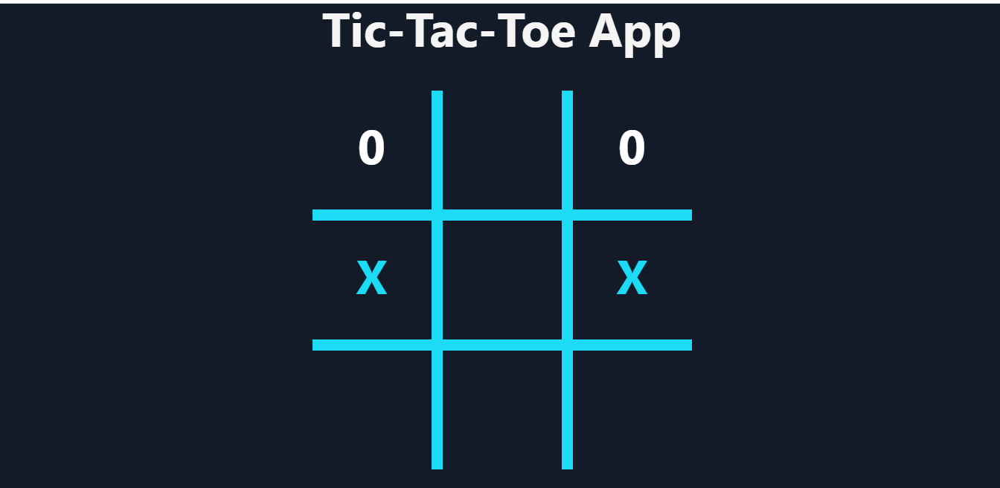

<h1 align="center"> Tic Tac Toe Game</h1>
<h2>Tic-tac-toe is a game in which two players take turns in drawing either an ` O' or an ` X' in one square of a grid consisting of nine squares. The winner is the first player to get three of the same symbols in a row.  </h2>  

<div>
<h1>Deployment link</h1>

https://vinod-sudokugame.netlify.app/

</div>

<h2>Tech stack used for the application</h2>


<div>

  
    
            
    
</div>

<h1>Game Screen</h1>
<p align="center">

<p>


<h2> Features </h2>

<ul>
<li>Fully responsive</li>
<li>After fill all the boxes it will give the message weather anyplayer has won the game or game tie. </li>

</ul>


<h2>Getting Started</h2>
<div>

<h3>Prerequisites</h3>
<ul>
<li>React</li>
<li>HTML</li>
<li>CSS</li>
</ul>

<h3>Setup</h3>


```
git clone https://github.com/vin9012d/tic_toc_toe.git
```

<h3>Install</h3>


<p>To install all the dependences of the project, run the following command:</p>

```
npm install
```

<p>To run the application got to the client folder and run the following command:</p> 

```
npm start
```
</div>

<h2>Contact<h2>
<p align="left">
    <a href="https://www.linkedin.com/in/vin9012d/">
        
    </a>
      <a title="vin9012c@gmail.com.com" href="mailto:vin9012c@gmail.com.com">
        
    </a>
 
    
  
</p>

<p>© 2022 Vinod Chaudhari</p>

<h2>Show your support</h2>
<p>Give a star if you like this project!</p>

